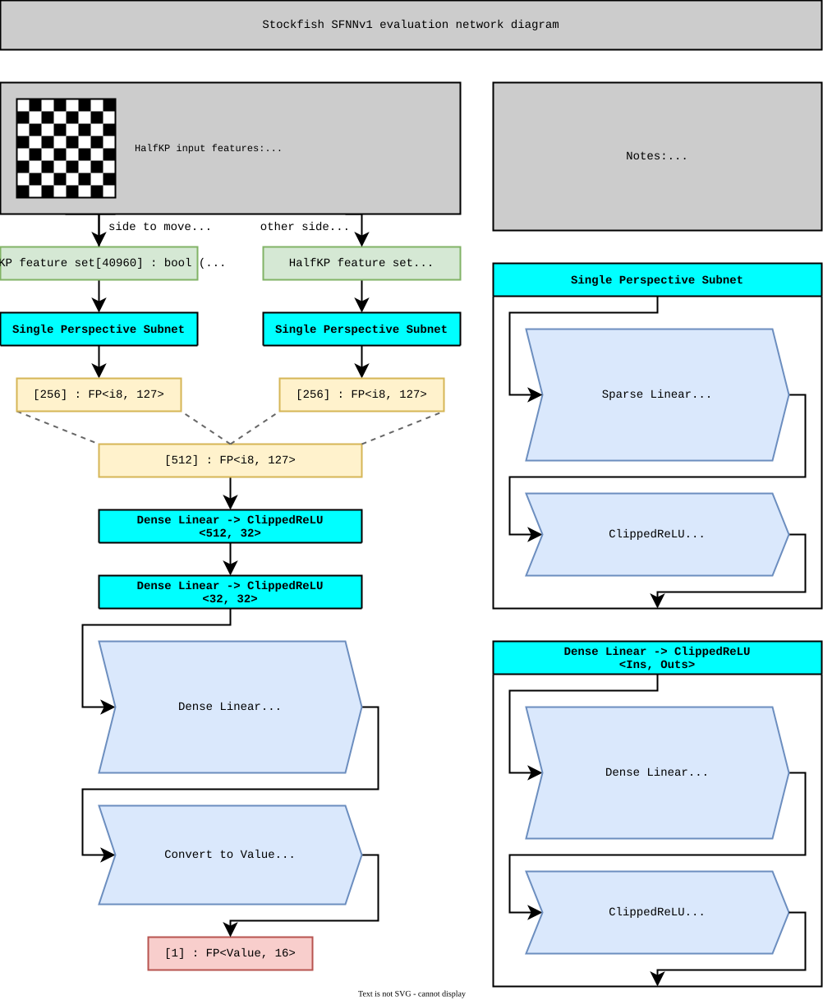
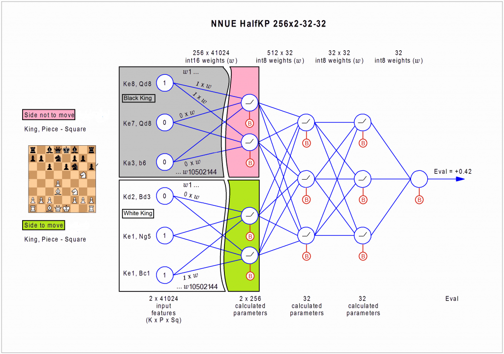

### NNUE architecture

Below is the stockfish nnue architecture for the original and most basic implementation. This is the closest version to what I will be implementing.

Here is a representation of pretty much the same thing but more visually like a neural network. This is exactly the version I am implementing.

The HalfKP architecture has 41,024 input features calculating every possible combination of a king and another piece on the board. There are 64 possible squares for the king, 10 possible pieces (excluding the kings) and the piece can be on any of 64 squares. Thus we have a three dimension tuple (KING_SQUARE, PIECE_TYPE, PIECE_SQUARE). Note there are 64 * 10 = 640 piece square combinations but we reserve 1 extra slot for padding/to be empty. This is what gives us our 641 * 64 = 41024 features.